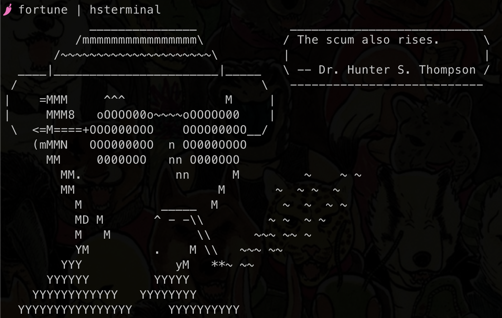

# Hunter S. Terminal

A simple fork of [cowsay](https://github.com/schacon/cowsay) with original ASCII art and inline dialogue bubble.  

Install by running `./install.sh`. 

Works great with [`fortune`](https://en.wikipedia.org/wiki/Fortune_(Unix)), like so:

